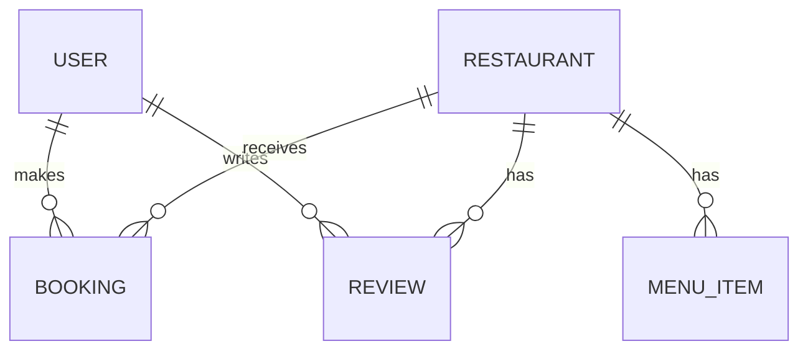

# Restaurant Booking Platform — Database Schema Documentation (Phase 3)

## 1. Overview

This document describes the database schemas for the **Restaurant Booking Platform**. The database stores information for restaurants, menus, users, reviews, and bookings. Schemas are designed to support both frontend and backend applications, providing APIs and data structures for web and mobile clients.

The platform uses **MongoDB** with geospatial support. Schemas include fields, types, indexes, and relationships.

---

| Collection    | Description                          | Key Fields                          |
|--------------|--------------------------------------|-------------------------------------|
| User         | Platform users and admins            | email, role, passwordHash          |
| Restaurant   | Restaurant listings and details      | name, location, cuisines, ratingAvg|
| MenuItem     | Food items for each restaurant       | name, price, category              |
| Review       | User ratings and reviews             | restaurantId, userId, rating       |
| Booking      | Table reservations                   | restaurantId, userId, bookingTime  |

## 2. Collections / Models

### 2.1 User

Stores information about platform users and admins.

**Fields:**

* `_id`: ObjectId
* `name`: String
* `email`: String (unique)
* `passwordHash`: String
* `phone`: String
* `role`: Enum ['user','admin']
* `createdAt`, `updatedAt`: Date

**Indexes:**

* Unique index on `email`

**Usage:**

* Authentication and role-based authorization.
* Booking ownership.
* Review submissions.

### 2.2 Restaurant

Information about restaurants listed on the platform.

**Fields:**

* `_id`: ObjectId
* `name`: String
* `description`: String
* `location`: { type: 'Point', coordinates: [longitude, latitude] } // GeoJSON
* `address`: { street, city, state, postalCode, country }
* `cuisines`: [String]
* `priceLevel`: Number (1-4)
* `contact`: { phone, website, email }
* `images`: [String] (URLs)
* `openingHours`: [ { day: 0..6, open: '09:00', close: '22:00', isClosed: Boolean } ]
* `amenities`: [String]
* `ratingAvg`: Number (pre-aggregated)
* `ratingCount`: Number (pre-aggregated)
* `createdBy`: ObjectId (User reference)
* `createdAt`, `updatedAt`: Date

**Indexes:**

* `2dsphere` index on `location` for geospatial queries.
* Text index on `name`, `description`, `cuisines` for search.

**Usage:**

* Display restaurant details to users.
* Search nearby restaurants.
* Admin management of listings.

### 2.3 MenuItem

Information about each menu item offered by restaurants.

**Fields:**

* `_id`: ObjectId
* `restaurantId`: ObjectId (reference)
* `name`: String
* `description`: String
* `price`: Number
* `category`: String
* `available`: Boolean
* `image`: String (URL)

**Usage:**

* Show menus on frontend.
* Allow admins to manage menu items.

### 2.4 Review

Stores user reviews and ratings for restaurants.

**Fields:**

* `_id`: ObjectId
* `restaurantId`: ObjectId (reference)
* `userId`: ObjectId (reference)
* `rating`: Number (1-5)
* `text`: String
* `images`: [String] (optional)
* `createdAt`, `updatedAt`: Date

**Indexes:**

* Compound index on `(restaurantId, createdAt)` for listing recent reviews.

**Usage:**

* Display ratings and reviews on frontend.
* Aggregate rating summaries.

### 2.5 Booking / Reservation

Stores information about table reservations.

**Fields:**

* `_id`: ObjectId
* `restaurantId`: ObjectId (reference)
* `userId`: ObjectId (reference)
* `partySize`: Number
* `bookingTime`: DateTime
* `status`: Enum ['pending','confirmed','cancelled','completed']
* `specialRequests`: String (optional)
* `createdAt`, `updatedAt`: Date

**Usage:**

* Allow users to create, update, and cancel bookings.
* Admins can manage bookings per restaurant.

**Concurrency:**

* Use optimistic concurrency or transactions to prevent double-bookings.

## 3. Relationships Overview

* `User` → can have many `Booking` and `Review`
* `Restaurant` → can have many `MenuItem`, `Review`, and `Booking`
* Pre-aggregated fields in `Restaurant` (like `ratingAvg`) improve read performance for frontend display.

## 4. Database Schema Diagram

