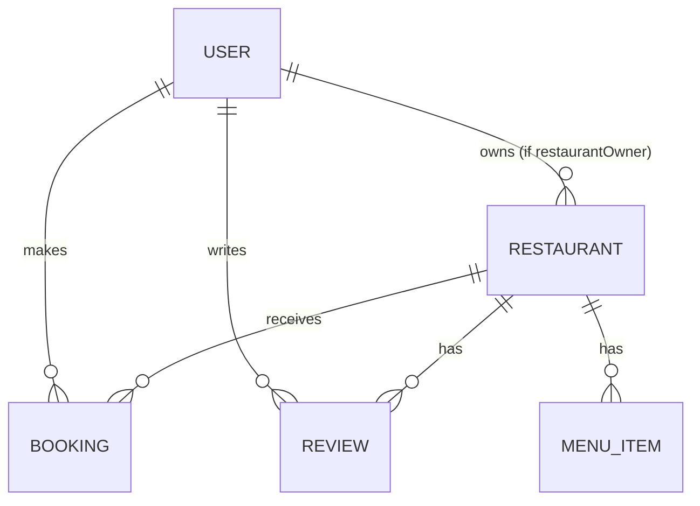

# Restaurant Booking Platform — Database Schema Documentation (Phase 3)

## 1. Overview

This document describes the database schemas for the **Restaurant Booking Platform**. The database stores information for users, restaurants, menus, reviews, and bookings. The design supports both frontend and backend applications (web and mobile) and follows a clean, scalable data structure.

The platform uses **MongoDB** with **geospatial indexing** for location-based search. Relationships are designed with references and pre-aggregated fields for performance.

---

| Collection    | Description                               | Key Fields                          |
|----------------|-------------------------------------------|-------------------------------------|
| User           | Platform users, restaurant owners, admins | email, role, passwordHash           |
| Restaurant     | Restaurant listings and details           | name, location, cuisines, ratingAvg  |
| MenuItem       | Menu items for each restaurant            | name, price, category               |
| Review         | User ratings and reviews                  | restaurantId, userId, rating        |
| Booking        | Table reservations                        | restaurantId, userId, bookingTime   |

---

## 2. Collections / Models

### 2.1 User
Stores information about all users, including **User**, **RestaurantOwner**, and **Admin** roles.

**Fields:**
- `_id`: ObjectId
- `name`: String
- `email`: String (unique)
- `passwordHash`: String
- `phone`: String
- `role`: Enum [`user`, `restaurantOwner`, `admin`]
- `createdAt`, `updatedAt`: Date

**Indexes:**
- Unique index on `email`

**Usage:**
- Used for authentication and authorization.
- Determines access levels for creating restaurants, bookings, and managing data.

---

### 2.2 Restaurant
Stores restaurant information, ownership, and details.

**Fields:**
- `_id`: ObjectId
- `name`: String
- `description`: String
- `location`: { type: 'Point', coordinates: [longitude, latitude] }
- `address`: { street, city, state, postalCode, country }
- `cuisines`: [String]
- `priceLevel`: Number (1–4)
- `contact`: { phone, website, email }
- `images`: [String]
- `openingHours`: [ { day: Number (0–6), open: String, close: String, isClosed: Boolean } ]
- `amenities`: [String]
- `ratingAvg`: Number (pre-aggregated)
- `ratingCount`: Number (pre-aggregated)
- `status`: Enum [`pending`, `approved`, `rejected`]
- `ownerId`: ObjectId (reference to User with role `restaurantOwner`)
- `createdAt`, `updatedAt`: Date

**Indexes:**
- `2dsphere` index on `location` for geospatial queries.
- Text index on `name`, `description`, and `cuisines` for search.

**Usage:**
- Visible to users once approved by `admin`.
- Managed by `restaurantOwner` (their own restaurants) and `admin`.

---

### 2.3 MenuItem
Represents dishes offered by a restaurant.

**Fields:**
- `_id`: ObjectId
- `restaurantId`: ObjectId (reference)
- `name`: String
- `description`: String
- `price`: Number
- `category`: String
- `available`: Boolean
- `image`: String

**Usage:**
- Displayed to users under restaurant details.
- Managed by `restaurantOwner` for their restaurant or `admin`.

---

### 2.4 Review
Stores user feedback and ratings.

**Fields:**
- `_id`: ObjectId
- `restaurantId`: ObjectId (reference)
- `userId`: ObjectId (reference)
- `rating`: Number (1–5)
- `text`: String
- `images`: [String]
- `createdAt`, `updatedAt`: Date

**Indexes:**
- Compound index on `(restaurantId, createdAt)` for latest reviews.

**Usage:**
- Only users who booked a restaurant can review it (optional rule).
- Aggregated rating fields are updated on review creation/deletion.

---

### 2.5 Booking / Reservation
Handles all reservation details between users and restaurants.

**Fields:**
- `_id`: ObjectId
- `restaurantId`: ObjectId (reference)
- `userId`: ObjectId (reference)
- `partySize`: Number
- `bookingTime`: DateTime
- `status`: Enum [`pending`, `confirmed`, `cancelled`, `completed`]
- `specialRequests`: String (optional)
- `createdAt`, `updatedAt`: Date

**Usage:**
- Created by `user`.
- Confirmed/managed by `restaurantOwner` or `admin`.

**Concurrency:**
- Transactions or optimistic locking prevent double-bookings for the same slot.

---

## 3. Relationships Overview

- `User` → can have many `Bookings` and `Reviews`
- `RestaurantOwner` (User) → can manage many `Restaurants`
- `Restaurant` → has many `MenuItems`, `Reviews`, and `Bookings`
- `Admin` → can approve/reject `Restaurants`, manage users, and monitor platform data

Pre-aggregated fields (like `ratingAvg` and `ratingCount`) improve frontend performance.

---

## 4. Database Schema Diagram

